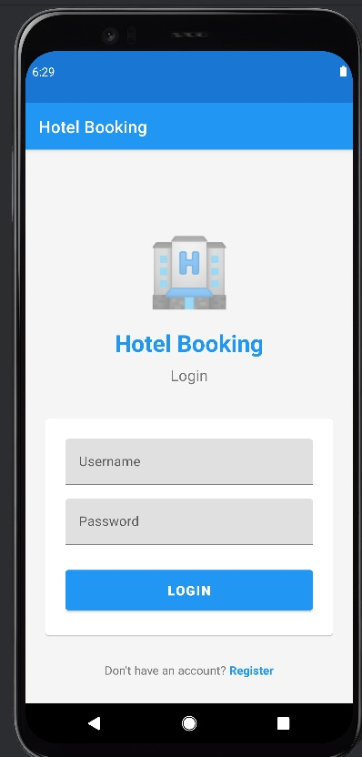
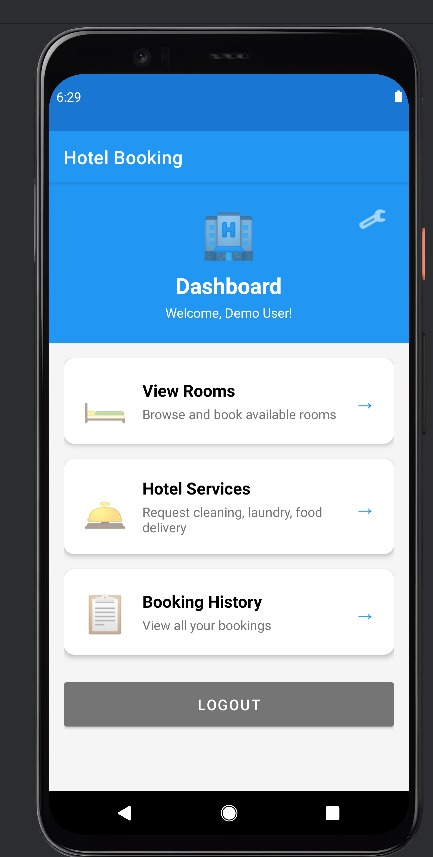
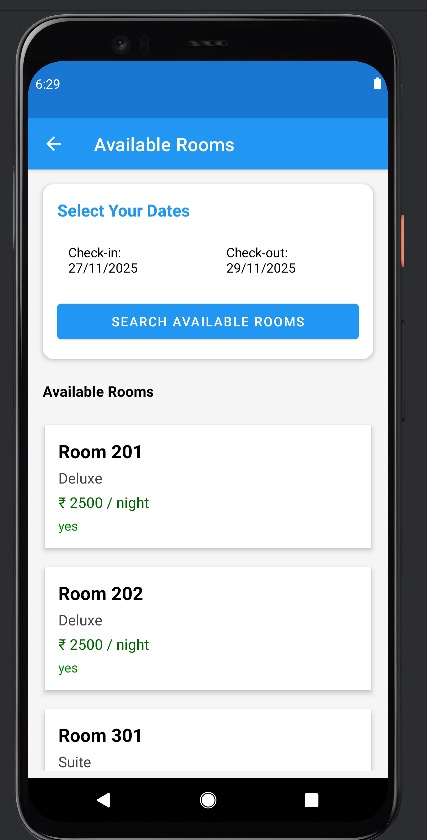
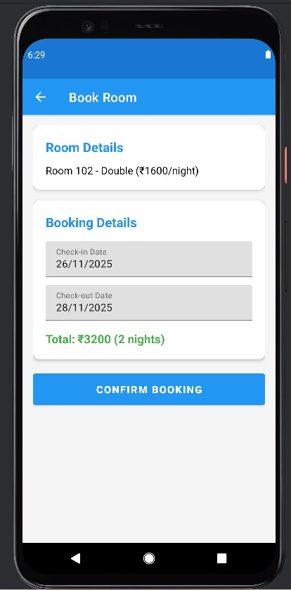
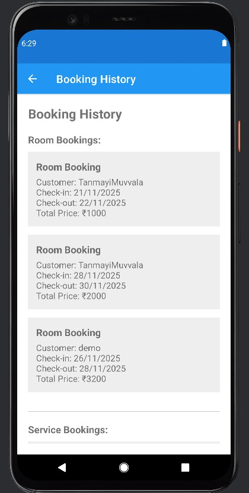
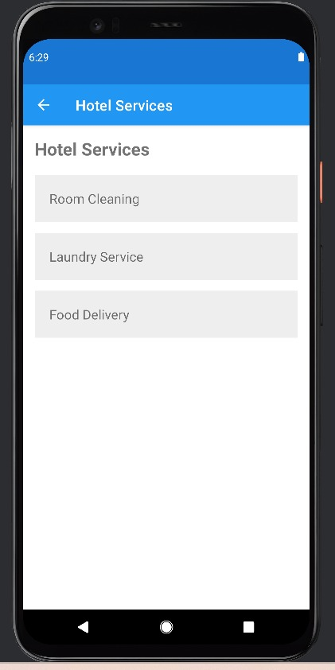

# 🏨 Hotel Room Booking App

A professional Android hotel booking application with user authentication, room management, service booking, and profile management.

---

## ✨ Features

### 🔐 User Management
- User Registration
- Secure Login (SQLite-based)
- Profile Management
- Auto-login (Session Management)

### 🛏️ Room Booking
- Browse available rooms
- Detailed room information
- Smart date picker (check-in/check-out)
- Automatic total price calculation

### 🛎️ Hotel Services
- Room Cleaning
- Laundry Service
- Food Delivery

### 📋 Booking Management
- View booking history
- Detailed records

### ⚙️ Settings & Profile
- Update profile
- Settings page
- About section
- Logout

### 🎨 UI/UX Enhancements
- Material Design UI
- Smooth transitions
- Responsive layouts
- Card-based modern UI

---

## 🛠️ Tech Stack

- Language: Java
- Database: SQLite
- UI: Material Design Components
- Architecture: Activity-based + DBHelper
- Min SDK: 23
- Target SDK: 36

---

## 📱 App Structure

```
├── Activities
│   ├── SplashActivity
│   ├── LoginActivity
│   ├── RegisterActivity
│   ├── DashboardActivity
│   ├── ProfileActivity
│   ├── SettingsActivity
│   ├── RoomsListActivity
│   ├── RoomDetailsActivity
│   ├── BookRoomActivity
│   ├── ServicesListActivity
│   ├── BookServiceActivity
│   └── BookingHistoryActivity
├── Database
│   └── DatabaseHelper
├── Models
│   ├── RoomModel
│   ├── RoomBookingModel
│   └── ServiceBookingModel
└── Adapters
    └── RoomAdapter
```

---

## 🗄️ Database Schema

### Users Table
- user_id
- username (unique)
- password
- full_name
- email
- phone

### Rooms Table
- room_id
- room_number
- room_type
- price
- description
- availability
- image_url

### RoomBookings Table
- booking_id
- room_id (FK)
- customer_name
- checkin_date
- checkout_date
- total_price

### ServiceBookings Table
- service_id
- service_type
- room_no
- time_slot
- notes
- price

---

## 🚀 Getting Started

### Prerequisites
- Android Studio
- JDK 11+
- Android SDK 23+

### Installation
```bash
git clone https://github.com/TanmayiMuvvala/HotelRoomBookingApp.git
cd HotelRoomBookingApp
```

### Running the App
Open Android Studio → Sync Gradle → Run ▶️

---

## 👤 Test Credentials

Username: **demo**  
Password: **demo123**

---

## 📦 Pre-loaded Data

### Sample Rooms
- Room 101 — Single — ₹1000/night
- Room 102 — Double — ₹1600/night
- Room 201 — Deluxe — ₹2500/night
- Room 301 — Suite — ₹4000/night
- Room 302 — Presidential Suite — ₹4000/night

### Services
- Room Cleaning — ₹200
- Laundry Service — ₹150
- Food Delivery — ₹300

---

## 🎯 Key Improvements
- Registration & Login
- Profile Management
- Settings Page
- Date Picker Booking
- Auto Price Calculation
- Material UI Enhancements
- Smooth Transitions
- Input Validation
- Error Handling Fixes
- Memory Leak Fixes

---

## 📸 Screenshots

<p align="center">
  
  
  
</p>

<p align="center">
  
  
  
</p>


---

# 👨‍💻 Developer

**Developed By: Tanmayi Muvvala**  
B.Tech (CSE – AI & ML), VR Siddhartha Engineering College  
Android Developer | AI Enthusiast | Problem Solver

---

# 📞 Contact

**Author:** Tanmayi Muvvala  
**Email:** tanmayimuvvala@gmail.com  
**GitHub:** https://github.com/TanmayiMuvvala  

---

## 📄 License
MIT License

---

**Version:** 1.0  
**Last Updated:** 2024  
**Status:** 🚀 Production Ready
